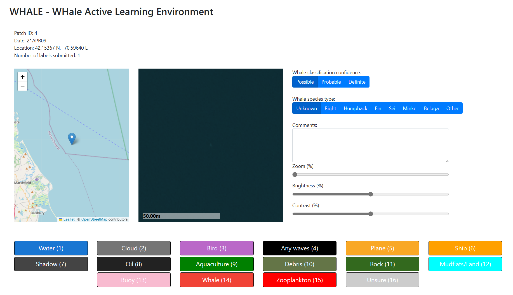

# An Active Learning Pipeline for Identifying Whales in High-resolution Satellite Imagery

**Jump to: [Setup](#setup) | [Interesting point detector](#interesting-point-detector) | [Labeling tool](#labeling-tool) | [Results](#results)**


This repository contains code for an [_active learning_](https://en.wikipedia.org/wiki/Active_learning_(machine_learning)) pipeline for detecting whales in high-resolution satellite imagery. This consists of two parts:
- A script for detecting __interesting points__ in imagery
- A labeling tool that runs an active learning pipeline to classify each __interesting point__ as a whale or not


<p align="center">
    
</p>

## Setup

First, run the following commands to create a conda environment, `whales`, with the necessary dependencies for running the scripts in this repository.
```
conda env create -f environment.yml
conda activate whales
```

Download and preprocess a coastline boundary for the United States from (1 : 500,000) Census cartographic boundary data:
```
wget https://www2.census.gov/geo/tiger/GENZ2021/shp/cb_2021_us_state_500k.zip
unzip cb_2021_us_state_500k.zip
ogr2ogr -clipdst -125.156 24.207 -66.797 49.210 -nln out -f GeoJSON tmp.geojson cb_2021_us_state_500k.shp
ogr2ogr -f GPKG cb_2021_us_state_500k.gpkg tmp.geojson -nln out -dialect sqlite -sql "SELECT ST_Union(geometry) as geometry FROM out"
mv cb_2021_us_state_500k.gpkg data/
rm tmp.geojson
rm cb_2021_us_state_500k.*
```


## Interesting point detector

The first part in our pipeline is an _interesting point detector_. There is a huge amount of variance in satellite imagery, even for images taken over the empty ocean, and there are few dataset of labeled whales in satellite imagery.
As such, we take an unsupervised modeling approach to identify anomalous points that are offshore in order to feed a human-in-the-loop labeling pipeline instead of attempting to directly train a model to segment/classify whales.

**Usage example**: The following command will load Maxar satellite imagery off the coast of Turkey (released by Maxar as part of their Open Data Program), then look for groups of anomalous pixels, and save the centroid locations of such groups to `results/` in GeoJSON format.
```bash
python generate_interesting_points.py --input_url "https://maxar-opendata.s3.amazonaws.com/events/Kahramanmaras-turkey-earthquake-23/ard/37/031133021120/2023-02-12/10300100E1B9D900-visual.tif" --output_fn results/interesting_points.geojson --method big_window --difference_threshold 20
```


## Labeling tool

The second part of our pipeline is a web based active learning interface. This interface allows a user to label a set of interesting points as either a whale or not a whale. As a user labels points, an active learning algorithm selects the next set of points to label based on a lightweight model.

Running this labeling tool requires a preprocessing step that creates image chips around each interesting point:
```bash
python prepare_data_for_labeling_tool.py --run_name demo_run --image_url "https://maxar-opendata.s3.amazonaws.com/events/Kahramanmaras-turkey-earthquake-23/ard/37/031133021120/2023-02-12/10300100E1B9D900-visual.tif" --output_dir labeling-tool/inputs/demo_run/ --input_fn results/interesting_points.geojson --dar "Demo Imagery" --catid "10300100E1B9D900" --date "2023-02-12"
```

The following command runs the labeling tool and allows us to access it at `http://localhost:12351`
```bash
cd labeling-tool
python server.py --remote_host localhost --input_dir inputs/demo_run/ --port 12351
```


## License

This project is licensed under the [MIT License](LICENSE).

The datasets are licensed under the [Open Use of Data Agreement v1.0](https://cdla.dev/open-use-of-data-agreement-v1-0/).


## Contributing

This project welcomes contributions and suggestions.  Most contributions require you to agree to a
Contributor License Agreement (CLA) declaring that you have the right to, and actually do, grant us
the rights to use your contribution. For details, visit https://cla.opensource.microsoft.com.

When you submit a pull request, a CLA bot will automatically determine whether you need to provide
a CLA and decorate the PR appropriately (e.g., status check, comment). Simply follow the instructions
provided by the bot. You will only need to do this once across all repos using our CLA.

This project has adopted the [Microsoft Open Source Code of Conduct](https://opensource.microsoft.com/codeofconduct/).
For more information see the [Code of Conduct FAQ](https://opensource.microsoft.com/codeofconduct/faq/) or
contact [opencode@microsoft.com](mailto:opencode@microsoft.com) with any additional questions or comments.

## Trademarks

This project may contain trademarks or logos for projects, products, or services. Authorized use of Microsoft 
trademarks or logos is subject to and must follow 
[Microsoft's Trademark & Brand Guidelines](https://www.microsoft.com/en-us/legal/intellectualproperty/trademarks/usage/general).
Use of Microsoft trademarks or logos in modified versions of this project must not cause confusion or imply Microsoft sponsorship.
Any use of third-party trademarks or logos are subject to those third-party's policies.
