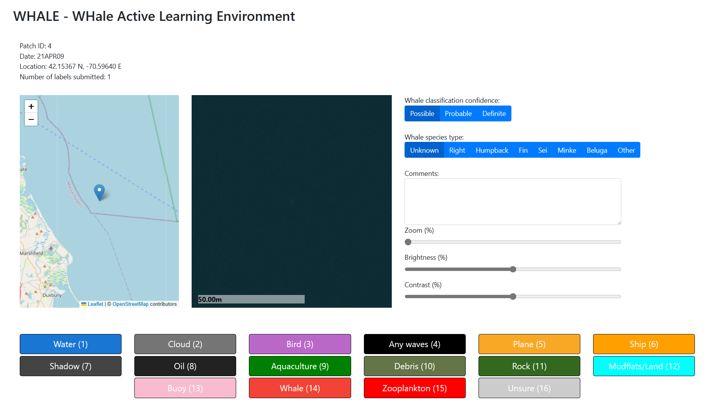

# An Active Learning Pipeline for Identifying Whales in High-resolution Satellite Imagery

**Jump to: [Setup](#setup) | [Interesting point detector](#interesting-point-detector) | [Interesting point filtering](#interesting-point-filtering) | [Labeling tool](#labeling-tool) | [Results](#results)**


This repository contains code for an [_active learning_](https://en.wikipedia.org/wiki/Active_learning_(machine_learning)) pipeline for detecting whales in high-resolution satellite imagery. This consists of two parts:
- A script for detecting __interesting points__ in imagery
- A labeling tool that runs an active learning pipeline to classify each __interesting point__ as a whale or not


<p align="center">
    
    <b>Figure 1: </b>Screenshot of the labeling tool interface.
</p>

## Setup

First, run the following commands to create a conda environment, `whales`, with the necessary dependencies for running the scripts in this repository.
```
conda env create -f environment.yml
conda activate whales
```

The environment installs this repository as an editable Python package. If the native geospatial dependencies are already available, the package can also be installed directly:

```bash
python -m pip install .
```

Installation provides these commands:

```text
filter-interesting-points
generate-interesting-points
```

The original `python <script>.py` commands remain supported. The installed version is available as `whales.__version__`.
Python support is currently capped at 3.13 because Fiona 1.10.1 does not publish Python 3.14 wheels, and building Fiona from source requires GDAL development files.

## Testing

After creating and activating the conda environment, run the full unit and synthetic-data integration test suite with:

```bash
python -m pytest -q tests
```

Download and preprocess a coastline boundary for the United States from (1 : 500,000) Census cartographic boundary data:
```
wget https://www2.census.gov/geo/tiger/GENZ2021/shp/cb_2021_us_state_500k.zip
unzip cb_2021_us_state_500k.zip
ogr2ogr -clipdst -125.156 24.207 -66.797 49.210 -nln out -f GeoJSON tmp.geojson cb_2021_us_state_500k.shp
ogr2ogr -f GPKG cb_2021_us_state_500k.gpkg tmp.geojson -nln out -dialect sqlite -sql "SELECT ST_Union(geometry) as geometry FROM out"
mv cb_2021_us_state_500k.gpkg data/
rm tmp.geojson
rm cb_2021_us_state_500k.*
```


## Interesting point detector

The `generate_interesting_points.py` script is the first step in our pipeline. It uses an unsupervised approach to identify anomalous points in satellite imagery that are offshore. These "interesting points" are then fed into the labeling tool.

The script works by scanning the image and identifying pixels that stand out from their surroundings. It offers several methods for this, each with its own strengths:

-   **`big_window`**: This method compares a pixel to the median value of a large surrounding window. It's effective at finding bright objects on a dark background, such as white water from a whale surfacing.
-   **`rolling_window`**: This method uses a smaller, rolling window, making it more sensitive to smaller-scale anomalies.
-   **`gmm`**: A Gaussian Mixture Model approach (currently not implemented).

**Command-line Arguments**:
-   `--input_fn`: The URL or local path to the satellite image to process.
-   `--output_fn` or `--output_dir`: The path to save the output GeoJSON file or directory.
-   `--land_mask_fn`: Path to a vector file containing a polygon to exclude from processing.
-   `--study_area_fn`: Path to a vector file defining the region of interest.
-   `--method`: The detection method to use (`big_window`, `rolling_window`).
-   `--big_window_size`: Window size for the `big_window` method.
-   `--rolling_window_size`: Kernel size for the `rolling_window` method.
-   `--min_stdev`: Minimum standard deviation to use as the denominator, reducing high scores in low-variance areas.
-   `--area_threshold` and `--max_area_threshold`: The minimum and maximum size of a feature to keep.
-   `--difference_threshold`: The threshold (in standard deviations) for a pixel to be considered anomalous.
-   `--auto_difference_threshold`: Automatically set the difference threshold based on the distribution of deviations.
-   `--bands`: Comma-separated list of band indices to use.
-   `--return-full-shapes`: Output full polygon shapes with deviation statistics instead of centroid points.
-   `--write-deviation-raster`: Write the deviation values to a raster file for debugging.

**Usage example**: The following command will load Maxar satellite imagery off the coast of Turkey, use the `big_window` method to find groups of anomalous pixels, and save the centroid locations of these groups to `results/` in GeoJSON format.
```bash
python generate_interesting_points.py \
    --input_fn "https://maxar-opendata.s3.amazonaws.com/events/Kahramanmaras-turkey-earthquake-23/ard/37/031133021120/2023-02-12/10300100E1B9D900-visual.tif" \
    --output_fn results/interesting_points.geojson \
    --method big_window \
    --difference_threshold 20
```

## Interesting point filtering

The `ip_pg2pt_filter.py` script provides a flexible way to process and filter GeoJSON features. It can convert polygon geometries to centroids, calculate NDWI and pan values when raster data is provided, and filter features based on various criteria.

**Key Features**:
- **Centroid Conversion**: Converts polygon geometries to points (centroids).
- **NDWI Calculation**: If a multiband raster is provided, it calculates the Normalized Difference Water Index (NDWI) for each feature and filters out those with a value < 0.3
- **Panchromatic Value Calculation**: If a panchromatic image is provided, it calculates the mean pan value for each feature and filters out features with a value > 600 (assumes 0-2000 strettched TOA values)
- **Percentile Filtering**: Filters features based on a specified percentile of a score property (e.g., `deviation_mean`).
- **Field Renaming**: Renames fields (e.g., `deviation_mean` to `deviation`) before exporting.

**Usage Example**:
The following command demonstrates how to use the script to process a GeoJSON file, filter it based on the 90th percentile of the `deviation_mean` scores, and save the output.

```bash
filter-interesting-points results/interesting_points.geojson results/filtered_points.geojson --filter-by-percentile 90
```


## Labeling tool

The second part of our pipeline is a web based active learning interface. This interface allows a user to label a set of interesting points as either a whale or not a whale. As a user labels points, an active learning algorithm selects the next set of points to label based on a lightweight model.

Running this labeling tool requires a preprocessing step that creates image chips around each interesting point:
```bash
python prepare_data_for_labeling_tool.py --run_name demo_run --image_url "https://maxar-opendata.s3.amazonaws.com/events/Kahramanmaras-turkey-earthquake-23/ard/37/031133021120/2023-02-12/10300100E1B9D900-visual.tif" --output_dir labeling-tool/inputs/demo_run/ --input_fn results/interesting_points.geojson --dar "Demo Imagery" --catid "10300100E1B9D900" --date "2023-02-12"
```

The following command runs the labeling tool and allows us to access it at `http://localhost:12351`
```bash
cd labeling-tool
python server.py --remote_host localhost --input_dir inputs/demo_run/ --port 12351
```

## Releases

This project uses [Semantic Versioning](https://semver.org/) and publishes versioned source and wheel artifacts on the [GitHub Releases page](https://github.com/microsoft/whales/releases). See the [release instructions](RELEASING.md) for the maintainer process.


## License

This project is licensed under the [MIT License](LICENSE).

The datasets are licensed under the [Open Use of Data Agreement v1.0](https://cdla.dev/open-use-of-data-agreement-v1-0/).


## Contributing

This project welcomes contributions and suggestions. Most contributions require you to agree to a Contributor License Agreement (CLA) declaring that you have the right to, and actually do, grant us the rights to use your contribution. For details, visit https://cla.opensource.microsoft.com.

When you submit a pull request, a CLA bot will automatically determine whether you need to provide a CLA and decorate the PR appropriately (e.g., status check, comment). Simply follow the instructions provided by the bot. You will only need to do this once across all repos using our CLA.

This project has adopted the [Microsoft Open Source Code of Conduct](https://opensource.microsoft.com/codeofconduct/).
For more information see the [Code of Conduct FAQ](https://opensource.microsoft.com/codeofconduct/faq/) or contact [opencode@microsoft.com](mailto:opencode@microsoft.com) with any additional questions or comments.

## Trademarks

This project may contain trademarks or logos for projects, products, or services. Authorized use of Microsoft trademarks or logos is subject to and must follow [Microsoft's Trademark & Brand Guidelines](https://www.microsoft.com/en-us/legal/intellectualproperty/trademarks/usage/general).
Use of Microsoft trademarks or logos in modified versions of this project must not cause confusion or imply Microsoft sponsorship.
Any use of third-party trademarks or logos are subject to those third-party's policies.
